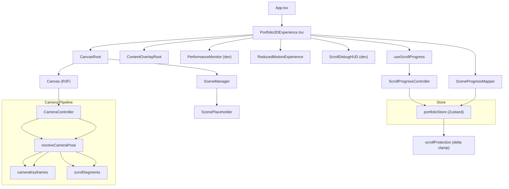

# Full Project Report — All Phases + Cinematic System Audit
## Cinematic 3D Portfolio: *The System Behind Every Screen*

---

## Architecture Overview



---

# PHASE 1 — TECHNICAL SKELETON
**Status: ✅ LOCKED** (15 tasks + 1 recovery ticket)

Phase 1 built the entire runtime skeleton — from tooling to store to scroll pipeline to camera director to overlays — with no real 3D content. Every system uses placeholder data and is wired end-to-end.

---

## T1.1 — Tooling Baseline

**What:** Verified and locked the Vite + React + TypeScript tooling stack.

| Item | Config |
|------|--------|
| Bundler | Vite 5.4 |
| Framework | React 18 |
| Language | TypeScript (strict) |
| Linter | ESLint |
| Build scripts | `typecheck`, `lint`, `build`, `dev`, `preview` |

**Report:** [tooling-baseline-report.md](file:///D:/PORT/docs/portfolio-3d/tooling-baseline-report.md)

---

## T1.2 — Core Dependencies

**What:** Installed and locked the project dependency stack.

| Package | Purpose |
|---------|---------|
| `three` | WebGL 3D engine |
| `@react-three/fiber` | React renderer for Three.js |
| `@react-three/drei` | R3F utility components |
| `zustand` | Lightweight state management |

**Report:** [dependency-baseline-report.md](file:///D:/PORT/docs/portfolio-3d/dependency-baseline-report.md)

---

## T1.2A — Project Structure Hygiene

**What:** Cleaned up Vite starter boilerplate, consolidated entry points, and ensured a clean project structure.

**Report:** [project-structure-report.md](file:///D:/PORT/docs/portfolio-3d/project-structure-report.md)

---

## T1.3 — Folder Structure Scaffold

**What:** Created the 11-folder `src/portfolio3d/` module structure with `.gitkeep` files.

```
src/portfolio3d/
├── assets/       # Model/texture references
├── camera/       # Camera types, keyframes, director, controller
├── canvas/       # CanvasRoot, error boundary
├── content/      # TypeScript content contracts
├── debug/        # Dev-only debug overlays
├── fallback/     # Reduced motion, WebGL fallback
├── overlays/     # DOM overlay system
├── performance/  # FPS monitor, device tiering
├── scenes/       # 8 scene modules + SceneManager
├── scroll/       # Scroll controller, mapper, segments, protection
├── shared/       # Shared utilities
└── store/        # Zustand state store
```

**Report:** [folder-structure-report.md](file:///D:/PORT/docs/portfolio-3d/folder-structure-report.md)

---

## T1.3A — Gitignore Reconciliation

**What:** Merged `.gitignore` entries to prevent accidental commits of `dist/`, `node_modules/`, build caches, and IDE files.

**Report:** [gitignore-reconciliation-report.md](file:///D:/PORT/docs/portfolio-3d/gitignore-reconciliation-report.md)

---

## T1.4 — CanvasRoot Shell

**What:** Created the first runtime components.

| File | Purpose |
|------|---------|
| `Portfolio3DExperience.tsx` | Top-level experience container — wires all systems |
| `CanvasRoot.tsx` | R3F `<Canvas>` wrapper with camera config, DPR, GL settings |
| `CanvasErrorBoundary.tsx` | React error boundary for WebGL crashes |
| `CanvasFallback.tsx` | Fallback UI when Canvas errors |
| `CanvasRoot.css` | Canvas container styles |
| `Portfolio3DExperience.css` | Experience layout (scroll spacer + sticky canvas) |

**Key config:**
```tsx
<Canvas camera={{ position: [0,0,6], fov: 50, near: 0.1, far: 100 }}
        dpr={[1, 2]} gl={{ antialias: true, alpha: true, powerPreference: "high-performance" }} />
```

**Report:** [canvas-root-report.md](file:///D:/PORT/docs/portfolio-3d/canvas-root-report.md)

---

## T1.5 — Zustand Store Schema

**What:** Created the global state store.

| File | Purpose |
|------|---------|
| `store/storeTypes.ts` | `PortfolioState` interface + `DeviceTier` type |
| `store/portfolioStore.ts` | Zustand `create()` with typed setters |

**State shape:**
```ts
{
  scrollProgress: number;      // 0–1 global scroll position
  activeSceneIndex: number;    // 0–7 current scene
  sceneLocalProgress: number;  // 0–1 within scene
  deviceTier: "low" | "medium" | "high";
  reducedMotion: boolean;
  webglSupported: boolean;
  isLoading: boolean;
}
```

**Report:** [portfolio-store-report.md](file:///D:/PORT/docs/portfolio-3d/portfolio-store-report.md)

---

## T1.6 — ScrollProgressController

**What:** Created the scroll-to-store pipeline.

| File | Purpose |
|------|---------|
| `scroll/ScrollProgressController.ts` | RAF-batched scroll handler. Converts raw scroll position to 0–1 progress. |
| `scroll/useScrollProgress.ts` | React hook that creates/destroys the controller on mount/unmount. |

**Design:** Uses `requestAnimationFrame` to batch scroll events. Only commits to the store when progress changes by > 0.0001 (noise filter).

**Report:** [scroll-controller-report.md](file:///D:/PORT/docs/portfolio-3d/scroll-controller-report.md)

---

## T1.7 — SceneProgressMapper

**What:** Maps global progress to per-scene coordinates.

| File | Purpose |
|------|---------|
| `scroll/SceneProgressMapper.ts` | Pure function: `getSceneProgress(globalProgress, segments) → { sceneIndex, localProgress }` |
| `scroll/scrollSegments.ts` | `SCROLL_WEIGHTS` array (8 scenes) + `buildSceneSegments()` factory |

**Scroll weights:** Each scene gets a proportional slice of the 0–1 range. `buildSceneSegments()` converts weights into `{ start, end, sceneId }` segments.

**Report:** [scene-progress-mapper-report.md](file:///D:/PORT/docs/portfolio-3d/scene-progress-mapper-report.md)

---

## T1.8 — SceneManager Placeholders

**What:** Created the scene rendering system.

| File | Purpose |
|------|---------|
| `scenes/SceneManager.tsx` | Reads `activeSceneIndex` from store, renders the active scene's placeholder |
| `scenes/ScenePlaceholder.tsx` | Displays scene label, index, and local progress % |
| `scenes/index.ts` | Barrel export |

**8 scenes defined:**
1. Opening / Seal Activation
2. Hero Identity
3. Architecture Mindset
4. Projects Layer
5. Product UX Thinking
6. Responsive Performance
7. System Core / Backend Engine
8. Final Sync / Contact

**Report:** [scene-manager-report.md](file:///D:/PORT/docs/portfolio-3d/scene-manager-report.md)

---

## T1.9 — CameraDirector Skeleton

**What:** Created the pure camera interpolation engine.

| File | Purpose |
|------|---------|
| `camera/cameraTypes.ts` | `CameraPose` type: `{ position, target, fov }` + `SceneCameraStates` |
| `camera/CameraDirector.ts` | `resolveCameraPose(globalProgress, segments, keyframes) → CameraPose` |
| `camera/index.ts` | Barrel export |

**Design:** Pure function with zero side effects. Uses `easeInOutCubic` to interpolate between sub-phase poses. Segments each scene into 4 sub-phases:

| Sub-Phase | Local Range | Behavior |
|-----------|-------------|----------|
| Approach  | 0.00 – 0.25 | Move toward device |
| Enter     | 0.25 – 0.45 | Enter the screen |
| Immerse   | 0.45 – 0.80 | Hold steady (content focus) |
| Exit      | 0.80 – 1.00 | Pull back, prepare for next scene |

**Report:** [camera-director-report.md](file:///D:/PORT/docs/portfolio-3d/camera-director-report.md)

---

## T1.10 — ContentOverlayRoot

**What:** Created the DOM overlay system that renders text/content on top of the 3D canvas.

| File | Purpose |
|------|---------|
| `overlays/ContentOverlayRoot.tsx` | Reads active scene from store, renders per-scene text overlays |
| `overlays/ContentOverlayRoot.css` | Overlay positioning and typography styles |
| `overlays/index.ts` | Barrel export |

**Report:** [content-overlay-report.md](file:///D:/PORT/docs/portfolio-3d/content-overlay-report.md)

---

## T1.11 — ReducedMotionExperience

**What:** Accessibility fallback for users who prefer reduced motion.

| File | Purpose |
|------|---------|
| `fallback/ReducedMotionExperience.tsx` | Toggle button + static fallback view when reduced motion is active |
| `fallback/ReducedMotionExperience.css` | Styling for the accessibility toggle and static content |
| `fallback/index.ts` | Barrel export |

**Behavior:** Detects `prefers-reduced-motion` media query. Provides a manual toggle. When active, replaces the 3D canvas with a static DOM experience.

**Report:** [reduced-motion-report.md](file:///D:/PORT/docs/portfolio-3d/reduced-motion-report.md)

---

## T1.12 — WebGL Detection & Fallback

**What:** Detects WebGL support and shows a premium fallback page if unavailable.

| File | Purpose |
|------|---------|
| `performance/webglDetection.ts` | `detectWebGL()` — checks for WebGL 1 and WebGL 2 canvas contexts |
| `fallback/WebGLFallback.tsx` | Full-page dark-themed static layout when WebGL is unavailable |
| `fallback/WebGLFallback.css` | Premium fallback page styling (dark graphite, cyan accents) |

**Report:** [webgl-fallback-report.md](file:///D:/PORT/docs/portfolio-3d/webgl-fallback-report.md)

---

## T1.13 — PerformanceMonitor (Dev-Only)

**What:** Real-time FPS overlay for development.

| File | Purpose |
|------|---------|
| `performance/PerformanceMonitor.tsx` | RAF-based FPS counter, wrapped in `import.meta.env.DEV` guard |
| `performance/PerformanceMonitor.css` | Semi-transparent monospace styling (top-right corner) |
| `performance/index.ts` | Barrel export |

**Design pattern:** Inner `PerformanceMonitorContent` component does the work. Outer `PerformanceMonitor` returns `null` in production. This pattern is reused by `ScrollDebugHUD`.

**Report:** [performance-monitor-report.md](file:///D:/PORT/docs/portfolio-3d/performance-monitor-report.md)

---

## T1.14 — Manual Skeleton Journey Test (Assembly)

**What:** First integration test — wired all Phase 1 systems together.

**Wiring in `Portfolio3DExperience.tsx`:**
- `useScrollProgress()` → populates store with scroll data
- `useEffect` → `getSceneProgress()` → `setActiveScene()` (syncs scene index)
- `useEffect` → `resolveCameraPose()` → dev console log
- JSX: `<CanvasRoot>` + `<ContentOverlayRoot>` + `<PerformanceMonitor>` + `<ReducedMotionExperience>`

**Verified:** Full forward/reverse scroll journey through all 8 scenes with correct state transitions.

**Report:** [skeleton-journey-test-report.md](file:///D:/PORT/docs/portfolio-3d/skeleton-journey-test-report.md)

---

## P1.RECOVERY.01 — Sequence Reconciliation

**What:** Corrected a sequencing violation between T1.13 and T1.14. Verified dev-guard manually in both `dev` and `preview`. Created missing artifacts for T1.14.

**Report:** [recovery-report.md](file:///D:/PORT/docs/portfolio-3d/recovery-report.md)

---

## T1.15 — Phase 1 QA Gate

**What:** Final verification of all Phase 1 systems. Zero errors across `typecheck`, `lint`, `build`. Manual dev/prod testing confirmed all overlays, canvas, store, and scroll systems work correctly.

**Result: Phase 1 LOCKED ✅ — Phase 2 UNLOCKED**

**Report:** [phase-1-qa-gate-report.md](file:///D:/PORT/docs/portfolio-3d/phase-1-qa-gate-report.md)

---

# PHASE 2 — CAMERA + SCROLL JOURNEY PROTOTYPE
**Status: ✅ LOCKED** (10 tasks)

Phase 2 built the full camera motion pipeline — from keyframe data to runtime binding to safety guards to dev tooling. The camera now responds to the entire 0–1 scroll cycle for all 8 scenes.

---

## T2.1 — Camera Keyframe Data Structure

**What:** Defined the concrete camera poses for all 8 scenes.

| File | Purpose |
|------|---------|
| `camera/cameraKeyframes.ts` | `SCENE_CAMERA_KEYFRAMES` — position/target/fov for approach, enter, exit per scene |

**Structure per scene:**
```ts
{
  approach: { position: [x,y,z], target: [x,y,z], fov: number },
  enter:    { position: [x,y,z], target: [x,y,z], fov: number },
  exit:     { position: [x,y,z], target: [x,y,z], fov: number },
}
```

**Report:** [camera-keyframes-report.md](file:///D:/PORT/docs/portfolio-3d/camera-keyframes-report.md)

---

## T2.2 — Deterministic Interpolation Function

**What:** Verified and refined `resolveCameraPose` as a mathematically correct pure function.

**Key fixes:**
- Aligned segment boundary logic: `p >= s.start && p < s.end` with a `p === 1` final-segment guard
- Confirmed `easeInOutCubic` produces smooth cubic curves
- Verified determinism: same input → same output, always

**Report:** [interpolation-function-report.md](file:///D:/PORT/docs/portfolio-3d/interpolation-function-report.md)

---

## T2.3 — Approach Camera Motion

**What:** Created the runtime camera binding.

| File | Purpose |
|------|---------|
| `camera/CameraController.tsx` | React component inside `<Canvas>`. Uses `useThree()` + `usePortfolioStore` to read scroll state, calls `resolveCameraPose`, applies pose to the Three.js camera. |

**Report:** [camera-controller-report.md](file:///D:/PORT/docs/portfolio-3d/camera-controller-report.md)

---

## T2.4 — Enter Camera Motion

**What:** Extended `CameraController` guard from `0.25` → `0.45`.

**Report:** [enter-camera-motion-report.md](file:///D:/PORT/docs/portfolio-3d/enter-camera-motion-report.md)

---

## T2.5 — Immerse Camera Motion

**What:** Extended guard from `0.45` → `0.8`.

**Report:** [immerse-camera-motion-report.md](file:///D:/PORT/docs/portfolio-3d/immerse-camera-motion-report.md)

---

## T2.6 — Exit Camera Motion

**What:** Extended guard from `0.8` → `1.0`. **Full 0–1 cycle now covered.**

**Report:** [exit-camera-motion-report.md](file:///D:/PORT/docs/portfolio-3d/exit-camera-motion-report.md)

---

## T2.7 — Clipping Guards & Occlusion Culling Flags

**What:** Safety and optimization layer for the rendering pipeline.

| Change | Detail |
|--------|--------|
| `CanvasRoot.tsx` | Documented `near: 0.1` / `far: 100` clipping planes |
| `SceneManager.tsx` | Added `visible?: boolean` prop |
| `ScenePlaceholder.tsx` | Added `visible?: boolean` prop |
| **[NEW]** `cameraClipping.ts` | `CAMERA_NEAR`, `CAMERA_FAR`, `isCameraSafe()` |

**Report:** [clipping-guards-report.md](file:///D:/PORT/docs/portfolio-3d/clipping-guards-report.md)

---

## T2.8 — Reverse-Scroll State Protection

**What:** Scroll safety layer preventing scene-skipping under aggressive input.

| Change | Detail |
|--------|--------|
| **[NEW]** `scrollProtection.ts` | `clampScrollDelta()`, `resolveScrollDirection()`, `MAX_PROGRESS_DELTA = 0.015` |
| `portfolioStore.ts` | `setScrollProgress` with clamp01 |
| `ScrollProgressController.ts` | RAF-batched flush loop |

**Report:** [scroll-protection-report.md](file:///D:/PORT/docs/portfolio-3d/scroll-protection-report.md)

---

## T2.9 — Dev-Only Scroll Debug HUD

**What:** Real-time scroll/camera metrics overlay for development.

**Dev guard:** `if (!import.meta.env.DEV) return null`

**Report:** [scroll-debug-hud-report.md](file:///D:/PORT/docs/portfolio-3d/scroll-debug-hud-report.md)

---

## T2.10 — Phase 2 QA Gate

**Result: Phase 2 LOCKED ✅ — Phase 3 UNLOCKED**

**Report:** [phase-2-qa-gate-report.md](file:///D:/PORT/docs/portfolio-3d/phase-2-qa-gate-report.md)

---

# PHASE 3+ — SCENE IMPLEMENTATION & REFINEMENT
**Status: 🔧 IN PROGRESS**

Phases 3 through 10 implemented all 8 real 3D scenes, content overlays, transition signals, camera pacing recalibration, and cinematic transition copy.

### Completed Work (summary):

| Area | What was done |
|------|---------------|
| Scene 01 — Opening | GLB avatar, OpeningDevice, background particles, boot indicators |
| Scene 02 — Hero | LaptopDevice, HeroScreenContent, HeroOverlay with CTAs |
| Scene 03 — Architecture | UltraWideMonitor, ArchitectureScreenContent, 5-layer stack |
| Scene 04 — Projects | LaptopDevice, ProjectCaseStudyPanel, slide-deck layout |
| Scene 05 — Product UX | TabletDevice, ProductUXScreenContent, 4-step flow |
| Scene 06 — Responsive | MobileDevice, ResponsiveLayoutMorph, phone approach |
| Scene 07 — System Core | SystemCoreDevice, ServiceNodes, DatabaseCylinder, DataTunnel, ApiRoutePulse, DeploymentPipeline, SystemHeartbeat |
| Scene 08 — Contact | FinalContactLockup, FinalSystemComposition, contact form |
| Camera Recalibration | Task 1 — camera keyframes retuned for readable enter positions |
| Transition Copy | Task 2.1 — transitionCopy.ts with 7 approved captions |
| Caption Renderer | Task 2.2 — TransitionCaptionRenderer.tsx, exit/approach fade |
| Transition Signals | Task 3.1 — Scene06→07 DataTunnel source alignment |
| Transition Signals | Task 3.2 — Scene07→08 final contact signal alignment |
| Transition Signals | Task 3.3 — Scene03→04 architecture-to-projects signal |
| Static Cards | Fallback static card variants for Scenes 02, 03, 04, 06, 08 |
| Content Data | contactData, projectData, productThinkingData, systemCoreData, responsivePerformanceData |
| Spatial Board | spatialBoardConfig.ts (feature-flagged OFF) |
| Global Transition Layer | GlobalTransitionLayer.tsx — radial dimming during transitions |

---

# CINEMATIC SYSTEM AUDIT — MOTION & SCENE HANDOFF
**Audit Date: 2026-07-09**
**Status: 🔍 AUDIT COMPLETE**

---

## A. Executive Verdict

The current cinematic experience suffers from **three compounding problems**, not one:

1. **No scroll smoothing between wheel input and globalProgress** — the scroll pipeline intercepts native wheel events via `preventDefault()` and directly writes small discrete deltas to the store. Each wheel tick produces a discrete step in `scrollProgress`. While `scrollProtection.ts` defines `clampScrollDelta()` with exponential damping (8% per frame), **the store's `setScrollProgress` does not call `clampScrollDelta` at all** — it writes the raw clamped value directly. The damping code exists in `scrollProtection.ts` but is **dead code never invoked on the hot path**. Result: every wheel event produces a hard discrete jump in `scrollProgress`.

2. **Only the current scene is mounted** — with `SPATIAL_BOARD_ENABLED = false`, `getAdjacentSceneIndexes()` returns `[currentIndex]` only. The `FadeGroup` wrapping each scene always receives `opacity={1.0}` (hardcoded). When `activeSceneIndex` switches, the previous scene is **instantly unmounted** and the new scene is **instantly mounted at full opacity**. There is no blend window, no cross-fade, and no overlap period. This is the primary cause of the "hard jump" between scenes.

3. **Camera damping exists but is fighting the undamped scroll input** — `CameraController.tsx` applies frame-rate-independent exponential lerp with a speed factor of `8.5`, which is relatively fast (converges ~86% per second at 60fps). The camera smoothly chases its target pose, but since `scrollProgress` jumps discretely, the camera sees a staircase of target positions — it smoothly interpolates between steps, but those steps arrive too fast and too coarse for cinematic flow.

**The root cause is an architectural gap: the scroll damping layer was designed but never wired into the runtime path, and scene cross-fading was designed (FadeGroup exists) but never activated.**

---

## B. Source-of-Truth Architecture Map

### Current Actual Flow

```
wheel event (deltaY)
  → useScrollProgress.ts handleWheel()
    → e.preventDefault()  // kills native scroll
    → deltaY * 0.00008 = progressDelta  (clamp ±100px max)
    → current + progressDelta = nextProgress
    → portfolioStore.setScrollProgress(nextProgress)  // DIRECT WRITE, NO DAMPING
      → clamp01(progress)
      → getSceneProgress() → derive activeSceneIndex + sceneLocalProgress
      → Zustand set() → triggers React re-renders

  → CameraController.useFrame()
    → reads scrollProgress from store
    → resolveCameraPose(scrollProgress, segments, keyframes)
      → finds segment → computes localT → easeInOutCubic interpolation
      → returns target CameraPose
    → exponential lerp camera toward target (speed=8.5)
    → camera.position / lookAt / fov applied

  → SceneManager (React re-render)
    → reads scrollProgress from store
    → derives currentIdx from scrollProgress
    → getAdjacentSceneIndexes(currentIdx, max)
      → SPATIAL_BOARD_ENABLED=false → returns [currentIdx] only
    → renders ONLY the current scene
    → FadeGroup wraps with opacity=1.0 (hardcoded)
    → previous scene UNMOUNTED, new scene MOUNTED instantly
```

### Missing Links (designed but not wired)

```
❌ scrollProtection.clampScrollDelta()  — exists, never called on hot path
❌ ScrollProgressController.flush() loop — exists, bypassed by wheel handler
❌ FadeGroup opacity < 1.0              — exists, always receives 1.0
❌ Adjacent scene rendering              — exists, gated by SPATIAL_BOARD_ENABLED=false
```

---

## C. Root Cause Ranking

### P0 — Must Fix Now

| # | Issue | Impact | Source |
|---|-------|--------|--------|
| P0-1 | **Scene mounting is single-scene only; no cross-fade** | Hard instant cut between scenes. Previous scene vanishes, new scene appears at full opacity. This is the #1 cause of visual jumps. | [SceneManager.tsx](file:///D:/PORT/src/portfolio3d/scenes/SceneManager.tsx) line 209: `getAdjacentSceneIndexes()` returns only `[currentIndex]`. Line 221: `FadeGroup opacity={1.0}` hardcoded. |
| P0-2 | **Scroll damping is dead code** | `scrollProtection.clampScrollDelta()` with 8% exponential step exists but is never called. `portfolioStore.setScrollProgress()` directly writes `clamp01(progress)` with no damping. Every wheel tick is a discrete jump. | [portfolioStore.ts](file:///D:/PORT/src/portfolio3d/store/portfolioStore.ts) line 22: direct `clamp01()` write. [useScrollProgress.ts](file:///D:/PORT/src/portfolio3d/scroll/useScrollProgress.ts) line 62: direct store call. |

### P1 — Should Fix Soon

| # | Issue | Impact | Source |
|---|-------|--------|--------|
| P1-1 | **ContentOverlayRoot shows placeholder text** | "Product UX Content PENDING" etc. are hardcoded placeholder strings. | [ContentOverlayRoot.tsx](file:///D:/PORT/src/portfolio3d/overlays/ContentOverlayRoot.tsx) lines 10–18 |
| P1-2 | **Debug overlays visible in dev screenshots** | `ScrollDebugHUD` and `PerformanceMonitor` always visible in `npm run dev`. | [ScrollDebugHUD.tsx](file:///D:/PORT/src/portfolio3d/debug/ScrollDebugHUD.tsx) line 105 |
| P1-3 | **GlobalTransitionLayer contributes visual noise** | Radial dimming uses a dashed circle border that looks like debug geometry. | [GlobalTransitionLayer.tsx](file:///D:/PORT/src/portfolio3d/overlays/GlobalTransitionLayer.tsx) |

### P2 — Polish Later

| # | Issue | Impact | Source |
|---|-------|--------|--------|
| P2-1 | **Camera speed factor 8.5 is too fast** | Camera converges ~87% in 1s. For cinematic, 3.0–5.0 would be more fluid. | [CameraController.tsx](file:///D:/PORT/src/portfolio3d/camera/CameraController.tsx) line 36 |
| P2-2 | **Transition signals always visible from frame 0** | No fade-in gating; they appear at full strength when scene mounts. | Scene05, Scene06, DataTunnel components |
| P2-3 | **DOM overlay CSS transitions out of sync with 3D** | CSS uses `transition: opacity 0.4s` while 3D is instant mount/unmount. | [ContentOverlayRoot.css](file:///D:/PORT/src/portfolio3d/overlays/ContentOverlayRoot.css) line 29 |

---

## D. Scene Handoff Diagnosis

### Why scenes visually enter each other:

**They don't actually overlap** — the opposite problem is happening. Only one scene is ever mounted at a time. When `scrollProgress` crosses a segment boundary:

1. `getSceneProgress()` computes a new `activeSceneIndex`
2. `SceneManager` derives `currentIdx` from `scrollProgress`
3. `getAdjacentSceneIndexes(currentIdx, max)` returns `[currentIdx]` only
4. The previous scene's React element is removed from the tree
5. The new scene's React element is added with `FadeGroup opacity={1.0}`
6. Three.js renders the new scene at full opacity on the very next frame

**What the user perceives as "overlap"** is actually:
- The camera is still completing its damped motion toward the previous scene's exit pose when the new scene appears
- The new scene mounts at `[0,0,0]` with its own lights/geometry, but the camera hasn't reached the new scene's approach keyframe yet
- For 2–5 frames, the camera is pointing at the exit position of Scene N while rendering Scene N+1's geometry at origin
- This creates a jarring flash of the new scene's geometry seen from the wrong camera angle

### Scene 06 at 95% Exit / Scene 07 visible:

- Scene 06 exit phase: localProgress `0.85–1.00`
- At ~0.95, user is near the segment boundary
- `activeSceneIndex` flips from 5→6 at the exact boundary
- Scene 06 **instantly unmounted**, Scene 07 **instantly mounted**
- Camera still lerping toward Scene 06's exit position `[0, 0.1, 8.5]`
- But rendering Scene 07's server cluster geometry (rotation `[0.25, -0.45, 0]`)
- All scenes mount at `[0,0,0]` (`SPATIAL_BOARD_ENABLED = false`)

---

## E. Motion Smoothness Diagnosis

### Why motion feels step-based/hard:

1. **Wheel handler writes directly to store** — `handleWheel()` computes `progressDelta = clampedDeltaY * 0.00008` and calls `setScrollProgress()` directly. With typical wheel delta ~100px, this produces step of `0.008` per tick.

2. **No interpolation between ticks** — Each tick produces a new `scrollProgress`. Camera lerp smooths somewhat, but underlying `scrollProgress` is a staircase.

3. **Trackpad inertia is killed** — `e.preventDefault()` prevents browser momentum scrolling. The `0.00008` multiplier creates controlled but jerky feel.

4. **ScrollProgressController's damping loop is bypassed** — The `flush()` function has a RAF loop, but wheel handler calls `setScrollProgress` directly, so the controller's loop never runs for wheel input.

5. **scrollProtection.ts exponential damping never executes** — `clampScrollDelta()` applies `delta * 0.08` exponential step with max `0.015`. Would produce smooth motion if called. But `portfolioStore.setScrollProgress()` does `clamp01(progress)` with no damping. **Dead code.**

---

## F. Screenshot Diagnosis

### Screenshot 1: "Scene 06 at ~95% Exit while Scene 07 is strongly visible"

- User has scrolled to end of Scene 06's segment
- `scrollProgress` crosses Scene 06→07 boundary
- Scene 06 **instantly unmounted**, Scene 07 **instantly mounted** at `[0,0,0]`
- Camera still damping toward Scene 06's exit pose
- Scene 07's geometry (isometric server cluster) is visible at origin within the frustum
- Scene 07's lights immediately replace Scene 06's lights
- Result: hard visual swap with camera briefly pointing at wrong scene's geometry

### Screenshot 2: "Product UX Content PENDING / Active Scene: 5 visible"

- "Product UX Content PENDING" comes from `ContentOverlayRoot.tsx` `SCENE_PLACEHOLDERS` map
- Current code returns `null` for `scene-05-product-ux`, so this text should NOT be visible in latest code
- If visible, screenshot is from older build before null-render was added
- "Overlay mounted — Active Scene: 5" does NOT exist in current codebase — may be from older ContentOverlayRoot version
- CSS `content-overlay-debug` class exists in CSS but is not used in current JSX
- DOM overlays use CSS-driven show/hide while 3D scenes switch instantly — these are **not synchronized**

---

## G. Transition Signals Diagnosis

| Task | Signal | Assessment |
|------|--------|------------|
| Task 3.1 — Scene06→07 DataTunnel | Packet spheres traveling from `mobileSignalEntry` to core/api/queue | Internal to Scene 07. Uses Scene 07's `localProgress`. Appears immediately at mount. **Not harmful if cross-fade exists.** |
| Task 3.2 — Scene07→08 | No dedicated transition component in Scene 08 | Neutral |
| Task 3.3 — Scene03→04 | No dedicated transition component in Scene 04 | Neutral |

**Verdict: Transition signals are not the cause.** They work correctly within each scene's local coordinate system. Fix scene handoff first; signals will then work as intended.

**Recommendation: Do NOT gate or remove transition signals.**

---

## H. Debug Overlay Diagnosis

| Overlay | Guard | Visible in... | Issue? |
|---------|-------|---------------|--------|
| `ScrollDebugHUD` | `import.meta.env.DEV` | `npm run dev` only | Correct — hidden in prod |
| `PerformanceMonitor` | `import.meta.env.DEV` | `npm run dev` only | Correct — hidden in prod |
| `ReducedMotionExperience` | Always rendered | Always visible toggle button | Could confuse QA |

"Overlay mounted — Active Scene: X" text does **not exist** in current codebase. Likely from older build or browser devtools.

**Recommendation:** Add `?debug=true` URL parameter gate (Ticket 4). Do not implement now.

---

## I. Recommended Minimal Fix Plan

> [!IMPORTANT]
> These tickets must be executed in strict order. Each depends on the previous.

### Ticket 1 — Wire scroll damping into the store pipeline

**Problem:** `scrollProtection.clampScrollDelta()` exists but is never called.

**Fix:**
- Change `portfolioStore.setScrollProgress()` to call `clampScrollDelta(currentProgress, nextProgress)` before writing
- Or refactor `useScrollProgress.handleWheel()` to feed through `ScrollProgressController`
- Lower camera lerp speed from `8.5` to `4.0–5.0`

**Result:** Smooth continuous scroll instead of step-by-step.

---

### Ticket 2 — Implement scene cross-fade

**Problem:** Only current scene mounted. No visual blend.

**Fix:**
- `getAdjacentSceneIndexes()` returns `[prev, current, next]` even when `SPATIAL_BOARD_ENABLED=false`
- Compute `fadeOpacity` per scene based on proximity to segment boundary
- Pass computed opacity to `FadeGroup` instead of hardcoded `1.0`
- Limit overlap window to ~15% of segment range

**Result:** Smooth cross-fades instead of hard cuts.

---

### Ticket 3 — Synchronize DOM overlay transitions with 3D fades

**Problem:** DOM overlays use CSS `transition: opacity 0.4s` independently of 3D mounting.

**Fix:**
- Drive DOM overlay opacity from `sceneLocalProgress` instead of CSS class toggle
- Synchronize with 3D scene cross-fade from Ticket 2

**Result:** Text and 3D geometry appear/disappear together.

---

### Ticket 4 — Add debug overlay visibility control

**Problem:** Dev overlays always visible during `npm run dev`.

**Fix:**
- Add `?debug=true` URL parameter check
- Or keyboard shortcut `Ctrl+Shift+D` to toggle

**Result:** Clean QA screenshots without production builds.

---

## J. What NOT To Do

- ❌ No new visual features until scroll + handoff is fixed
- ❌ No more transition signal work (Task 3.x)
- ❌ No device expansion or viewport testing
- ❌ No background motion or ambient particles
- ❌ No avatar opening changes
- ❌ No broad architecture rewrite
- ❌ No GSAP/Framer Motion adoption
- ❌ No spatial board activation
- ❌ No content changes

---

## K. Files Inspected

| File | Why |
|------|-----|
| [Portfolio3DExperience.tsx](file:///D:/PORT/src/portfolio3d/Portfolio3DExperience.tsx) | Top-level wiring |
| [Portfolio3DExperience.css](file:///D:/PORT/src/portfolio3d/Portfolio3DExperience.css) | Scroll spacer, canvas shell |
| [SceneManager.tsx](file:///D:/PORT/src/portfolio3d/scenes/SceneManager.tsx) | Scene mounting, FadeGroup, adjacent selection |
| [CameraController.tsx](file:///D:/PORT/src/portfolio3d/camera/CameraController.tsx) | Camera damping, lerp factor |
| [CameraDirector.ts](file:///D:/PORT/src/portfolio3d/camera/CameraDirector.ts) | Pure interpolation, sub-phases |
| [cameraKeyframes.ts](file:///D:/PORT/src/portfolio3d/camera/cameraKeyframes.ts) | 8 scene camera poses |
| [cameraTypes.ts](file:///D:/PORT/src/portfolio3d/camera/cameraTypes.ts) | CameraPose types |
| [ScrollProgressController.ts](file:///D:/PORT/src/portfolio3d/scroll/ScrollProgressController.ts) | RAF flush loop (bypassed) |
| [useScrollProgress.ts](file:///D:/PORT/src/portfolio3d/scroll/useScrollProgress.ts) | Wheel interception, direct store writes |
| [scrollSegments.ts](file:///D:/PORT/src/portfolio3d/scroll/scrollSegments.ts) | Weights, segments, sub-phases |
| [scrollProtection.ts](file:///D:/PORT/src/portfolio3d/scroll/scrollProtection.ts) | Dead code: clampScrollDelta |
| [SceneProgressMapper.ts](file:///D:/PORT/src/portfolio3d/scroll/SceneProgressMapper.ts) | globalProgress → sceneIndex |
| [portfolioStore.ts](file:///D:/PORT/src/portfolio3d/store/portfolioStore.ts) | Zustand store, no damping |
| [storeTypes.ts](file:///D:/PORT/src/portfolio3d/store/storeTypes.ts) | State interface |
| [spatialBoardConfig.ts](file:///D:/PORT/src/portfolio3d/spatial/spatialBoardConfig.ts) | SPATIAL_BOARD_ENABLED=false |
| [ContentOverlayRoot.tsx](file:///D:/PORT/src/portfolio3d/overlays/ContentOverlayRoot.tsx) | DOM overlay slots, placeholders |
| [ContentOverlayRoot.css](file:///D:/PORT/src/portfolio3d/overlays/ContentOverlayRoot.css) | CSS transitions |
| [GlobalTransitionLayer.tsx](file:///D:/PORT/src/portfolio3d/overlays/GlobalTransitionLayer.tsx) | Radial dimming |
| [TransitionCaptionRenderer.tsx](file:///D:/PORT/src/portfolio3d/overlays/TransitionCaptionRenderer.tsx) | Caption fade logic |
| [HeroOverlay.tsx](file:///D:/PORT/src/portfolio3d/overlays/HeroOverlay.tsx) | CTA buttons |
| [ScrollDebugHUD.tsx](file:///D:/PORT/src/portfolio3d/debug/ScrollDebugHUD.tsx) | Dev debug panel |
| [ReducedMotionExperience.tsx](file:///D:/PORT/src/portfolio3d/fallback/ReducedMotionExperience.tsx) | Accessibility toggle |
| [CanvasRoot.tsx](file:///D:/PORT/src/portfolio3d/canvas/CanvasRoot.tsx) | R3F Canvas wrapper |
| [Scene05ProductUX.tsx](file:///D:/PORT/src/portfolio3d/scenes/Scene05ProductUX.tsx) | Tablet scene |
| [Scene06ResponsivePerformance.tsx](file:///D:/PORT/src/portfolio3d/scenes/Scene06ResponsivePerformance.tsx) | Mobile scene |
| [Scene07SystemCore.tsx](file:///D:/PORT/src/portfolio3d/scenes/Scene07SystemCore.tsx) | Server cluster scene |
| [scene06Config.ts](file:///D:/PORT/src/portfolio3d/constants/scene06Config.ts) | Scene 06 config |
| [scene07Config.ts](file:///D:/PORT/src/portfolio3d/constants/scene07Config.ts) | Scene 07 layout |
| [DataTunnel.tsx](file:///D:/PORT/src/portfolio3d/components/DataTunnel.tsx) | Transition signal |
| [transitionCopy.ts](file:///D:/PORT/src/portfolio3d/content/transitionCopy.ts) | 7 captions |
| [types.ts](file:///D:/PORT/src/portfolio3d/content/types.ts) | SceneId, content types |

---

## L. Final Recommendation

**Execute Ticket 1 first: Wire scroll damping into the store pipeline.**

This is the highest-impact single fix because:
- Immediately eliminates staircase/step-by-step feel
- Contained within 2–3 files (`portfolioStore.ts`, `useScrollProgress.ts`, `scrollProtection.ts`)
- Does not change any scene components, camera, or content
- Makes Ticket 2 (scene cross-fade) easier to test

Without Ticket 1, even a perfect cross-fade will feel "stepped" because `scrollProgress` changes in discrete jumps.

---

# COMPLETE FILE INVENTORY

## Source Files (Phase 1 + Phase 2 + Phase 3+)

### Root
| File | Task |
|------|------|
| `Portfolio3DExperience.tsx` | T1.4, T1.14, T2.9 |
| `Portfolio3DExperience.css` | T1.4 |

### `camera/`
| File | Task |
|------|------|
| `cameraTypes.ts` | T1.9 |
| `CameraDirector.ts` | T1.9, T2.2 |
| `cameraKeyframes.ts` | T2.1 |
| `CameraController.tsx` | T2.3–T2.6 |
| `cameraClipping.ts` | T2.7 |
| `index.ts` | T1.9 |

### `canvas/`
| File | Task |
|------|------|
| `CanvasRoot.tsx` | T1.4, T2.7 |
| `CanvasRoot.css` | T1.4 |
| `CanvasErrorBoundary.tsx` | T1.4 |
| `CanvasFallback.tsx` | T1.4 |

### `content/`
| File | Task |
|------|------|
| `types.ts` | T1.3 |
| `transitionCopy.ts` | Task 2.1 |
| `contactData.ts` | Phase 3+ |
| `productThinkingData.ts` | Phase 3+ |
| `projectData.ts` | Phase 3+ |
| `responsivePerformanceData.ts` | Phase 3+ |
| `storyMotifAnchors.ts` | Phase 3+ |
| `systemCoreData.ts` | Phase 3+ |

### `debug/`
| File | Task |
|------|------|
| `ScrollDebugHUD.tsx` | T2.9 |
| `ScrollDebugHUD.css` | T2.9 |
| `index.ts` | T2.9 |

### `fallback/`
| File | Task |
|------|------|
| `ReducedMotionExperience.tsx` | T1.11 |
| `ReducedMotionExperience.css` | T1.11 |
| `WebGLFallback.tsx` | T1.12 |
| `WebGLFallback.css` | T1.12 |
| `index.ts` | T1.11 |

### `overlays/`
| File | Task |
|------|------|
| `ContentOverlayRoot.tsx` | T1.10 |
| `ContentOverlayRoot.css` | T1.10 |
| `GlobalTransitionLayer.tsx` | Phase 3+ |
| `HeroOverlay.tsx` | Phase 3+ |
| `HeroOverlay.module.css` | Phase 3+ |
| `TransitionCaptionRenderer.tsx` | Task 2.2 |
| `TransitionCaptionRenderer.module.css` | Task 2.2 |
| `index.ts` | T1.10 |

### `performance/`
| File | Task |
|------|------|
| `PerformanceMonitor.tsx` | T1.13 |
| `PerformanceMonitor.css` | T1.13 |
| `webglDetection.ts` | T1.12 |
| `index.ts` | T1.13 |

### `scenes/`
| File | Task |
|------|------|
| `SceneManager.tsx` | T1.8, T2.7 |
| `ScenePlaceholder.tsx` | T1.8, T2.7 |
| `Scene01Opening.tsx` | Phase 3+ |
| `Scene02Hero.tsx` | Phase 3+ |
| `Scene03Architecture.tsx` | Phase 3+ |
| `Scene04Projects.tsx` | Phase 3+ |
| `Scene05ProductUX.tsx` | Phase 3+ |
| `Scene06ResponsivePerformance.tsx` | Phase 3+ |
| `Scene07SystemCore.tsx` | Phase 3+ |
| `Scene08Contact.tsx` | Phase 3+ |
| Static card variants | Phase 3+ |
| `index.ts` | T1.8 |

### `scroll/`
| File | Task |
|------|------|
| `ScrollProgressController.ts` | T1.6, T2.8 |
| `useScrollProgress.ts` | T1.6 |
| `SceneProgressMapper.ts` | T1.7 |
| `scrollSegments.ts` | T1.7 |
| `scrollProtection.ts` | T2.8 |

### `store/`
| File | Task |
|------|------|
| `storeTypes.ts` | T1.5 |
| `portfolioStore.ts` | T1.5, T2.8 |

### `components/` (Phase 3+)
23 scene component files + `background/` sub-directory

### `constants/` (Phase 3+)
9 per-scene config files (`scene01Config.ts` – `scene08Config.ts` + `backgroundConfig.ts`)

### `spatial/`
| File | Task |
|------|------|
| `spatialBoardConfig.ts` | Phase 3+ |

---

## Key Design Decisions

1. **Pure resolver pattern** — `resolveCameraPose` is stateless. Same input → same output.
2. **Incremental guard expansion** — Camera guard expanded T2.3→T2.6: `0.25` → `0.45` → `0.8` → `1.0`.
3. **Store-owned delta clamping** — Protection logic in store, not controller.
4. **Dev-guard pattern** — `import.meta.env.DEV` guard with tree-shaking.
5. **No animation libraries** — Pure `easeInOutCubic`. Scroll position is single source of truth.

---

AUDIT COMPLETE — Motion and scene handoff root causes identified. Ready for next repair ticket.
