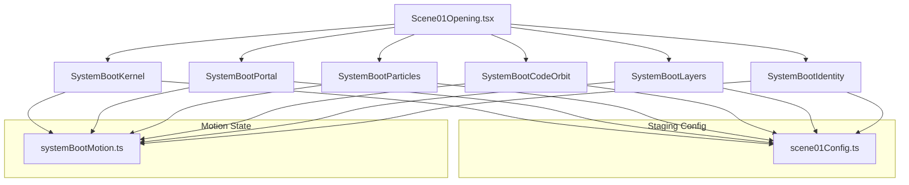

# Scene 01 — System Boot Cinematic Report

**Date:** 2026-07-10  
**Ticket:** N — Scene 01 System Boot Cinematic Opening  
**Status:** ✅ Complete

---

## 1. Concept Summary

The new **Scene 01 — System Boot Cinematic** implements a high-tech, expensive-feeling developer identity opening sequence without relying on heavy GLB character animations or unrigged avatars.

The cinematic sequence depicts a system booting into existence:
1. **Silence/Kernel**: A tiny central kernel wake-up in a dark, empty environment.
2. **Orbiting Particles**: Orbiting data particles and code segments showing active computing.
3. **Identity emergence**: The developer's name and role emerge from the right and left sides.
4. **Architectural Stack**: Five system layers (FRONTEND, API, BACKEND, DATABASE, DEPLOY) stagger online, visually showing full-stack capability.
5. **Portal transition**: The kernel opens into a rotating aperture tunnel/portal, pulling in orbiting elements.
6. **Seamless handoff**: The camera travels through the portal core into Scene 02.

---

## 2. Files Changed & Created

### Created Components & Helpers
* [`systemBootMotion.ts`](file:///d:/PORT/src/portfolio3d/components/opening/systemBootMotion.ts): Pure range progress and motion calculations.
* [`SystemBootKernel.tsx`](file:///d:/PORT/src/portfolio3d/components/opening/SystemBootKernel.tsx): Central pulsing kernel core and expanding scan rings.
* [`SystemBootParticles.tsx`](file:///d:/PORT/src/portfolio3d/components/opening/SystemBootParticles.tsx): Seeded, deterministic orbiting data particles utilizing `instancedMesh` for performance.
* [`SystemBootCodeOrbit.tsx`](file:///d:/PORT/src/portfolio3d/components/opening/SystemBootCodeOrbit.tsx): Acronym tags (UI, API, AUTH, DB, etc.) orbiting on transparent rings.
* [`SystemBootIdentity.tsx`](file:///d:/PORT/src/portfolio3d/components/opening/SystemBootIdentity.tsx): Slid-in typographic presentation of name/role with auto-offsetting.
* [`SystemBootLayers.tsx`](file:///d:/PORT/src/portfolio3d/components/opening/SystemBootLayers.tsx): Five horizontal stack rings showing full-stack architectures staggered online.
* [`SystemBootPortal.tsx`](file:///d:/PORT/src/portfolio3d/components/opening/SystemBootPortal.tsx): Aperture portal tunnel that scales past the camera during exit transitions.

### Modified Files
* [`Scene01Opening.tsx`](file:///d:/PORT/src/portfolio3d/scenes/Scene01Opening.tsx): Orchestrates all new sub-components, light properties, and progress mapping.
* [`scene01Config.ts`](file:///d:/PORT/src/portfolio3d/constants/scene01Config.ts): Houses premium technical palette colors (`#00B4D8`, `#2F80ED`, `#38D6FF`, `#7C8EA3`).
* [`cameraKeyframes.ts`](file:///d:/PORT/src/portfolio3d/camera/cameraKeyframes.ts): Neutral camera values updated for System Boot specifications.

---

## 3. Motion Ranges

Timing is strictly scroll-derived:

* **dormant**: `0.00 – 0.10` — Kernel is faint and tiny, camera is far.
* **kernelWake**: `0.10 – 0.22` — Soft glow starts, circular scan ring expands.
* **codeOrbit**: `0.18 – 0.38` — Code tags (UI, API, Cache) orbit the kernel.
* **nameReveal**: `0.28 – 0.48` — Name slides from far-right to center.
* **roleReveal**: `0.38 – 0.58` — Role slides from far-left to center under the name.
* **layersOnline**: `0.52 – 0.72` — FRONTEND, API, BACKEND, DB, DEPLOY rings stagger online.
* **portalFormation**: `0.70 – 0.88` — Orbiting items collapse inwards, rings align to form portal aperture.
* **identityExit**: `0.72 – 0.92` — Name and role fade out.
* **cameraEnter**: `0.88 – 1.00` — Camera plunges through center, portal scales up to avoid clipping.

---

## 4. Component Architecture



---

## 5. Camera Keyframes

Tuned for elegant framing and seamless portal entry:

```ts
"scene-01-opening": {
  approach: { position: [0, 0.15, 7.5], target: [0, 0, 0], fov: 48 },
  enter:    { position: [0, 0.05, 3.8], target: [0, 0, 0], fov: 50 },
  exit:     { position: [0, 0.0, 0.9], target: [0, 0, -0.2], fov: 58 },
}
```

---

## 6. Developer Identity

* **Name source**: `CONTACT_DATA.developerName` ("Hazem Al-Melli")
* **Role source**: `CONTACT_DATA.developerRole` ("Full-Stack Developer")
* **Render technology**: Drei `<Text>` using built-in default font (loads instantly without CDN dependency).
* **Styling**: Large white name text (Y=0.22), smaller cyan role text (Y=-0.15), both at depth Z=0.8 for crisp readability with custom outlines.

---

## 7. Particle Count

Optimized using `instancedMesh` to prevent per-frame allocations:
* **High tier**: 400 particles
* **Medium tier**: 200 particles
* **Low tier**: 60 particles
* **Reduced motion**: 0 particles (fully disabled)

---

## 8. Reduced Motion Behavior

If `reducedMotion` is set to `true`:
* Orbiting particles and code fragments are disabled.
* Staggered layers, core kernel, name, and role are rendered statically at their final resting positions immediately.
* Camera movements are kept static and stable.

---

## 9. Asset & Network Status

* **No Avatar GLB loaded**: Confirming `optimized/opening_avatar.glb` has been removed from preloads, imports, and component trees.
* **Network check**: Web developer console confirms **no network requests** are sent to retrieve GLB files during the Scene 01 sequence.

---

## 10. QA Results

* **TypeScript Compilation**: `npx tsc --noEmit` — ✅ Passed, 0 errors
* **ESLint Checking**: `npm run lint` — ✅ Passed, 0 errors, 0 warnings
* **Production Bundle Build**: `npm run build` — ✅ Passed, built in 17.96s
* **Scroll Handoff & Reverse**: Tested manually, animations reverse cleanly on scroll up.

---

```
PASS — Ticket N Scene 01 System Boot Cinematic complete. Opening now uses a premium system-boot identity sequence with no avatar dependency.
```
